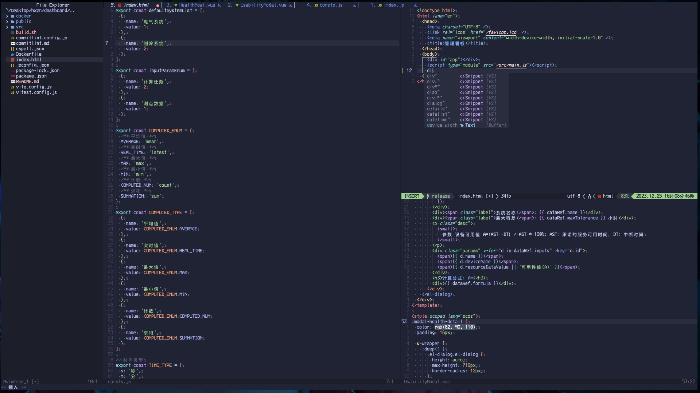

  

    
    
    
    
  

### 介绍

这是一个基于nvim前端项目通用配置，基本满足所有前端开发所有要求。

### 安装和启动

1. 进入Nivm默认配置目录

   - Mac: ~/.config/nvim
   - Window: $HOME/AppData/Local/nvim

2. 下载配置

> git clone https://github.com/Mkamvi/nvim-config-fe

3. 启动

   - Mac: nvim .
   - Window: nvim-qt.exe .

### 功能

1. 插件管理 [Lazy.nvim](https://github.com/folke/lazy.nvim)
2. 代码补全
3. LSP
4. Git支持
5. 状态栏j
6. 目录树
7. 格式化
8. 代码高亮

### 截图示例

### 快捷键

| 快捷键    | 模式 | 描述                    |
| --------- | ---- | ----------------------- |
| ; + e     | n    | 目录树切换              |
| ; + ef    | n    | 聚焦到目录树            |
| ; + wx    | n    | 窗口左右切换            |
| -         | n    | 垂直分割窗口            |
| \|        | n    | 水平分割窗口            |
| Sift + \< | n    | 向左扩大窗口            |
| Sift + \> | n    | 向右扩大窗口            |
| Sift + \^ | n    | 向上扩大窗口            |
| Ctrl + g  | t    | terminal 进入Normal模式 |
| ; + hs    | n    | 暂存区块                |
| ; + hu    | n    | 撤销区块                |
| ; + hn    | n    | 下一区块                |
| ; + hc    | n    | 预览区块                |
| ; + hr    | n    | 重置区块                |
| ; + hb    | n    | Blame区块               |
| ; + hd    | n    | Diff区块                |
| ; + g     | n    | LazyGit                 |
| ; + ]b    | n    | 下一窗口                |
| ; + [b    | n    | 前一窗口                |
| ; + q     | n    | 关闭当前Buffer          |
| ; + aq    | n    | 关闭所有Buffer          |
| ; + aa    | n    | 退出编辑器              |
| ; + 1~9   | n    | 进入第N个窗口           |
| ; + f     | n    | 代码格式化              |
| ctrl + l  | n    | 相对行号切换            |
| ctrl + s  | n    | 保存                    |
| ; + S     | n    | 全局搜索                |
| ; + w     | n    | 全文快速定位            |
| ; + xx    | n    | Trouble 窗口切换        |
